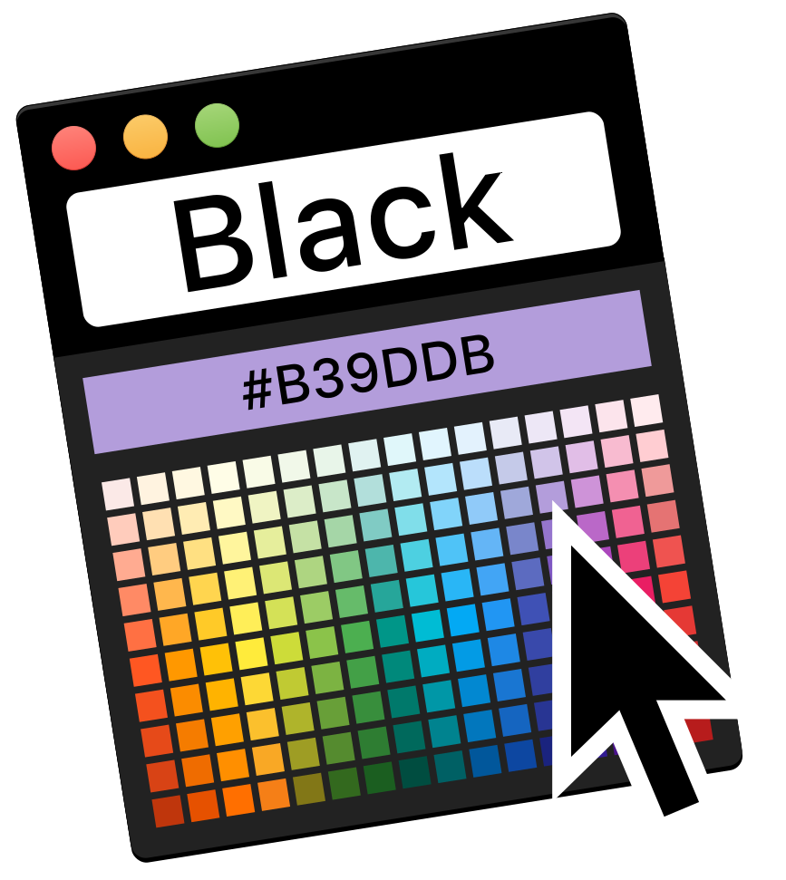
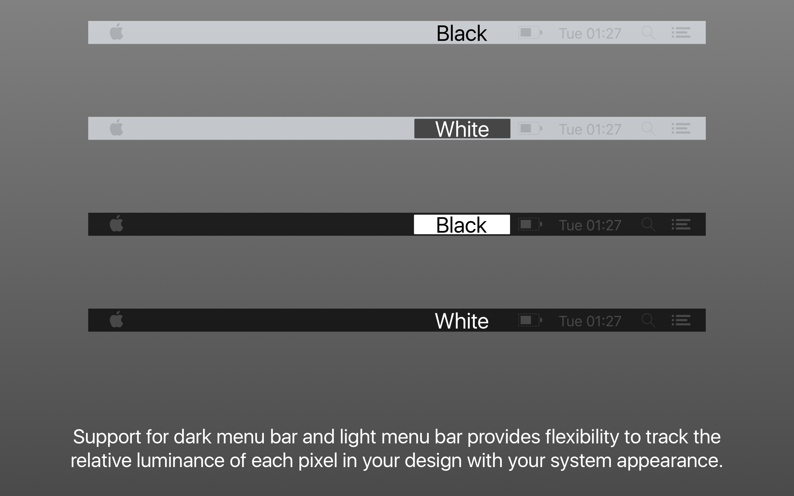
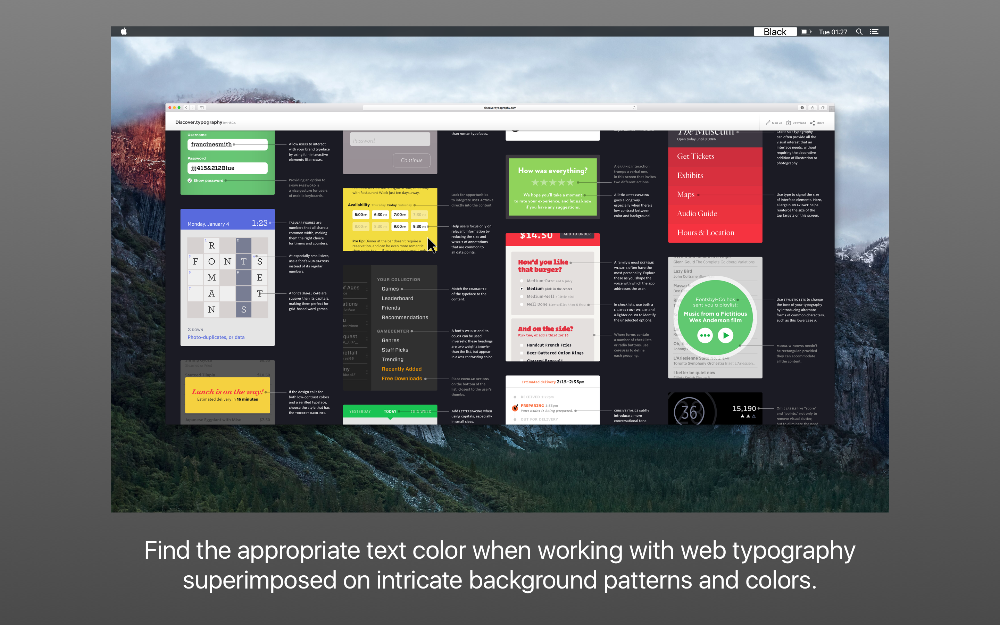
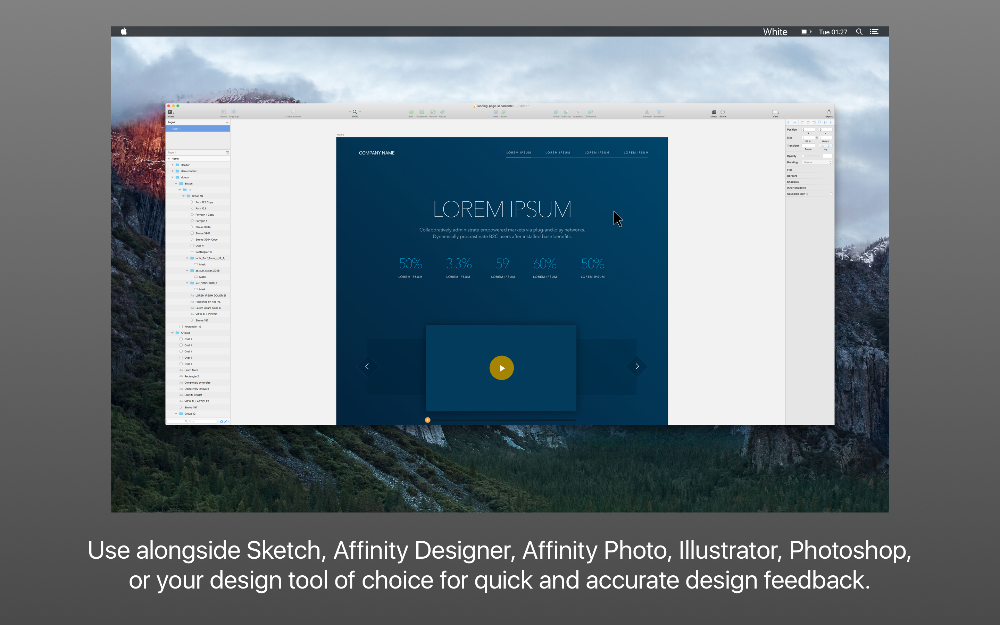
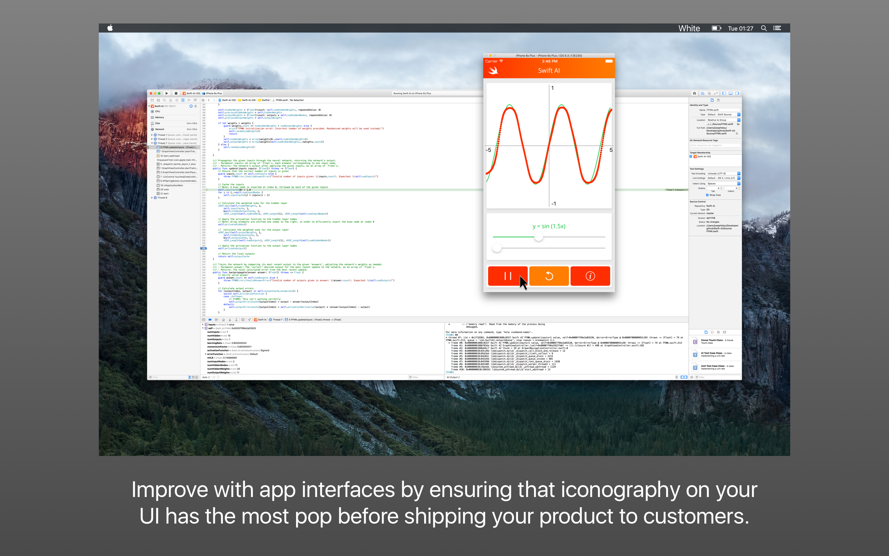

    <a href="https://www.designutilities.com/rellum">
        
         
                
    </a>
     

# Rellum

Rellum is a free design utiliity which lets you know when to use white or black text in your designs.

## Download

